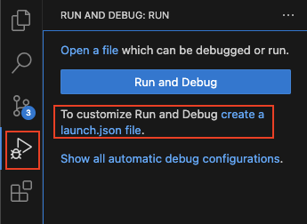

# Setting debugpy in vscode and running tests in docker bash shell

If you ever need to run tests in a container and set breakpoints in vscode, you can use the debugpy extension and package. In this example, I am developing django and running tests against different database backends using django-docker-box, but it can be applied to other projects as well.

Disclaimer: I haven't verified that these steps in this particular sequence will work. Hopefully this is enough to get going.

## Set Up
### 0. Clone the django-docker-box repo

```
git clone https://github.com/django/django-docker-box.git
cd django-docker-box
```

### 1. Set up launch.json

launch.json is located under `django-docker-box/.vscode/`. We can set it up by clicking on the "Run and Debug" icon on the sidebar in vscode.



I've set up the launch.json configuration to use port 5678 for debugpy, and the localRoot will point to the source code. I hardcoded localRoot the vscode variable `${workspaceFolder}` would be referencing django-docker-box directory, but the actual project that I am running is django.

```jsx
{
    // Use IntelliSense to learn about possible attributes.
    // Hover to view descriptions of existing attributes.
    // For more information, visit: https://go.microsoft.com/fwlink/?linkid=830387
    "version": "0.2.0",
    "configurations": [
        {
            "name": "Python Debugger: Remote Attach",
            "type": "debugpy",
            "request": "attach",
            "connect": {
                "host": "localhost",
                "port": 5678
            },
            "pathMappings": [
                {
                    "localRoot": "/Users/<myuserfolder>/projects/django/tests/",
                    "remoteRoot": "."
                }
            ]
        }
    ]
}
```
    
### 2. Add debugpy to django/tests/requirements/py3.txt

This allows the debugpy package to be installed in the django-docker-box image that gets built. It's not ideal to be adding debugpy in here, because I don't want to check this code into the django project, but this will do for now.

```
# django/tests/requirements/py3.txt
...
colorama >= 0.4.6; sys_platform == 'win32'
debugpy >= 1.8.6
```

### 3. Build django-docker-box

Run this command to build for the postgres backend. This creates the docker image `djangobox/django-docker-box`.

```bash
docker-compose build postgres
```

### 4. Run django-docker-box in bash shell

We're running django-docker-box with the bash shell and adding `-p 5678:5678` to expose the port from the container to the host. The debugger extension from vscode will connect to the host port.

We're dropping into the bash shell so we can run debugpy with the tests.

```bash
docker-compose run -p 5678:5678 --entrypoint bash postgres
```

The terminal prompt should now show that we are in the django-docker-box container for postgres:

```bash
test@62841875ce55:/tests/django/tests$
```

### 5. Run debugpy with tests within the bash shell

Now we can set breakpoints in vscode and run our tests!

```bash
debugpy --wait-for-client --listen 0.0.0.0:5678 ./runtests.py postgres_tests.test_array.TestSplitFormField
```

## Comments
* I tried to open the port for the image by setting `ports` in docker compose, but haven’t gotten that to work yet. Perhaps I need to rebuild the django-docker-box image.
* This is a hacky solution that hardcodes the localRoot in launch.json.
* I don't like that the command for the test in Step 5 is rather clunky. Perhaps I can improve this with some aliases. I also don't like the dot notation for the test modules. It would be nicer to leverage the tab completion for file paths. Perhaps this can be improved with a simple script that transforms file paths into dot notation.
* I haven't looked into how to set up tests in vscodes such that they run on the click of the file, but it would be a nice ui. Considering that django-docker-box is a separate project from django, I don't know how difficult it would be to configure such tests with the IDE. Something to consider in the future.
* I ran into problems running `docker-compose run ... postgres`. I think the service name was conflicting with the official postgres image that I already had on my machine. I renamed the django-docker-box service to be `postgres-django` just to work around this. Not sure if this was necessary.

If anyone has a different set up that is better than this, please let me know! I would love to know how to improve my development set up.